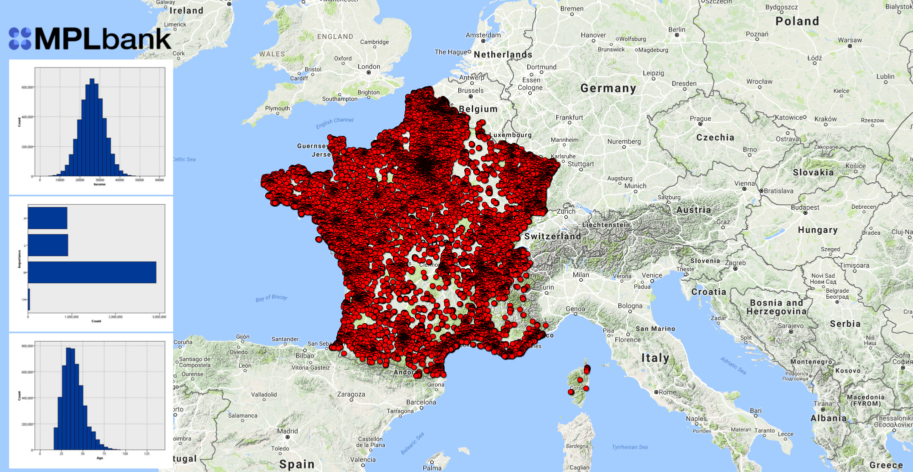

## MPLbank banking data

The MPlbank database contains more than 500,000 banking accounts and customers created with  [IBM SPSS] in order to add credibility for delivered demos as POC or as workload (1000 TPS) to International customers. This map represents French banking customers, stored in the MPLbank database. Published banking APIs will use this set of data and will allow developers to reach banking customers' data (profile, banking contracts) and banking accounts' data (balance, latest transaction).

## MPLbank Architecture Components

The journey is accomplished by using an Hybrid (IBM Cloud and IBM Z mainframe) architecture.

Deployed IBM Z Mainframe Technologies:
* [IBM CICS Transaction Server] ([IBM CICS TS Knowledge Center] & [IBM CICS TS developerWorks])
* [IBM z/OS Connect Enterprise Edition] ([IBM z/OS Connect EE Knowledge Center] & [IBM z/OS Connect EE developerWorks])
* [IBM Db2] ([IBM Db2 Knowledge Center])
* [IBM Master Data Management] ([IBM Master Data Management Knowledge Center])
* [IBM Machine Learning for z/OS]
* ... and a real core banking system ([SOPRA Account Management]) running in IBM CICS TS!

Deployed IBM Bluemix Technologies:
* [IBM API Connect] ([IBM API Connect Knowledge Center] & [IBM API Connect developerWorks])
* [IBM Secure Gateway Service]

An [IBM DataPower Gateway] ([IBM DataPower Gateway Knowledge Center]) has been setup in front of MPLbank for security reasons. It also acts as a Secure Gateway Client and is connected to the Secure Gateway Service in Bluemix.

[IBM CICS Transaction Server]: https://www-01.ibm.com/software/data/enterprise-application-servers/cics/
[IBM CICS TS Knowledge Center]: https://www.ibm.com/support/knowledgecenter/en/SSGMGV
[IBM CICS Developer Center]: https://developer.ibm.com/cics/

[IBM z/OS Connect Enterprise Edition]: https://www.ibm.com/ms-en/marketplace/connect-enterprise-edition
[IBM z/OS Connect EE Knowledge Center]: https://www.ibm.com/support/knowledgecenter/en/SS4SVW
[IBM Developer z/OS Connect EE]: https://developer.ibm.com/mainframe/products/zosconnect/

[IBM Db2]: https://www.ibm.com/analytics/us/en/technology/db2/?lnk=STW_US_SHP_A4_TL&lnk2=learn_DB2
[IBM Db2 Knowledge Center]: https://www.ibm.com/support/knowledgecenter/en/SSEPEK/db2z_prodhome.html

[IBM Master Data Management]: https://www.ibm.com/analytics/us/en/technology/master-data-management/
[IBM Master Data Management Knowledge Center]: https://www.ibm.com/support/knowledgecenter/en/SSWSR9

[IBM Machine Learning for z/OS]: https://www.ibm.com/ms-en/marketplace/machine-learning-for-zos

[SOPRA Account Management]: https://www.soprabanking.com/our-offer/solutions/account-management-9

[IBM API Connect]: http://www.ibm.com/software/products/en/api-connect
[IBM API Connect Knowledge Center]: https://www.ibm.com/support/knowledgecenter/en/SSMNED 
[IBM Developer API Connect]: https://developer.ibm.com/apiconnect/

[IBM Secure Gateway Service]: https://cloud.ibm.com/catalog/services/secure-gateway

[IBM DataPower Gateway]: http://www.ibm.com/software/products/en/datapower-gateway
[IBM DataPower Gateway Knowledge Center]: https://www.ibm.com/support/knowledgecenter/en/SS9H2Y
[IBM SPSS]: https://www.ibm.com/analytics/us/en/technology/spss/

<!-- keep this -->
## License

This code pattern is licensed under the Apache License, Version 2. Separate third-party code objects invoked within this code pattern are licensed by their respective providers pursuant to their own separate licenses. Contributions are subject to the [Developer Certificate of Origin, Version 1.1](https://developercertificate.org/) and the [Apache License, Version 2](https://www.apache.org/licenses/LICENSE-2.0.txt).

[Apache License FAQ](https://www.apache.org/foundation/license-faq.html#WhatDoesItMEAN)