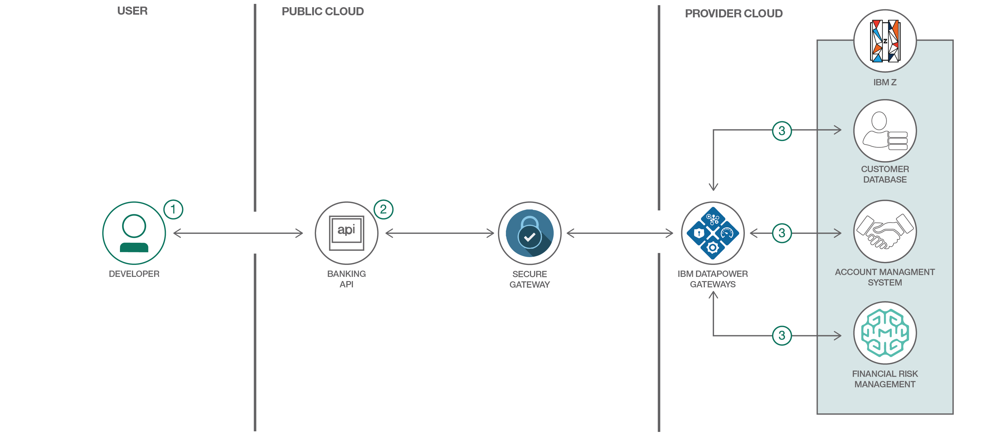
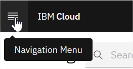
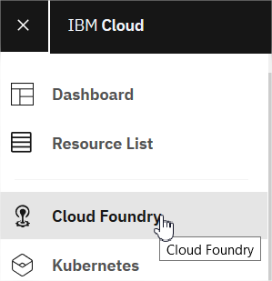
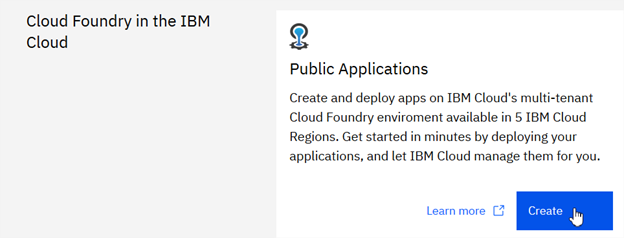
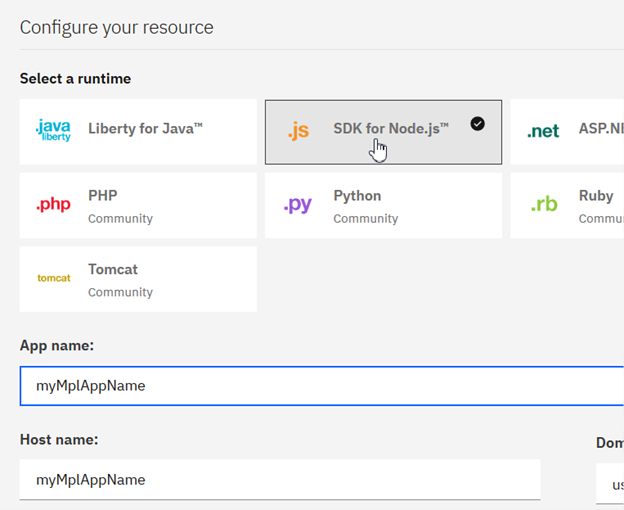
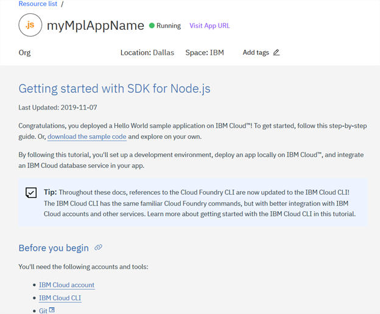
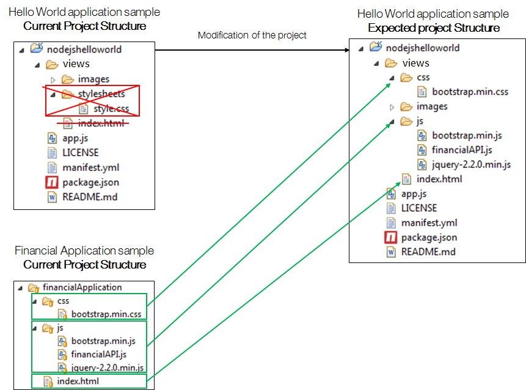
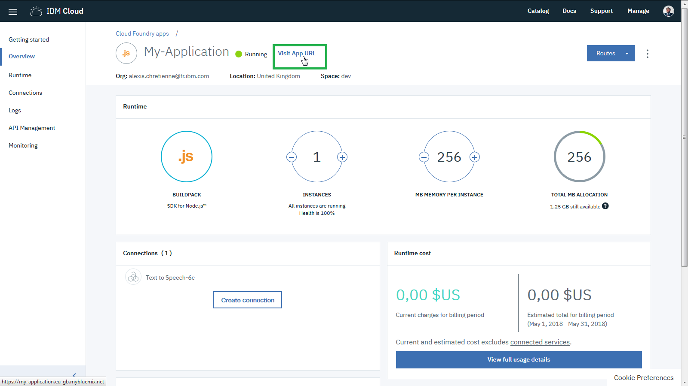

*Read this in other languages: [中国](README-cn.md).*

# Banking Digitalization using Hybrid Cloud with IBM Z.

The following journey will introduce the available Banking APIs published on IBM Cloud with logical business programs running on the IBM Z mainframe through a simulated retail bank called MPLbank.

# MPLbank

## Architecture

This journey accesses a fictitious retail banking system called MPLbank. MPLbank integrates an Account Management System, a Payment Hub (not shown in the schema), a Customer Management System and a Financial Risk Management System. On top of these components, an API layer hosted in IBM Cloud has been set up to deliver a banking API, and make them reachable from all kind of applications.

Published banking API includes:
* **/customers/** operation path calls the Customer Database services in MPLbank.
* **/accounts/** operation path calls the Account Management System services in MPLbank.
* **/customers/loan/** operation path calls the Financial Risk Management System service in MPLbank.

The Customer Database System and Financial Risk Management System expose services through built-in REST/JSON interfaces. In front of the Account Management System, IBM z/OS Connect EE has been set up to create REST/JSON Interfaces from COBOL programs running in CICS. As a result, these 3 sub-systems are flexible and reachable using REST/JSON APIs. These sub-systems act as micro-services by delivering REST/JSON interfaces and IBM API Connect acts as an API layer to manage a unique and final set of banking REST/JSON APIs. The resulting hybrid architecture approach enables the best of both worlds and builds a fast and secure API Economy.

More information about data in [MPLbank Readme].

The objectives of this journey are to discover, test and use this Banking API using a sample banking application, then enhance it using IBM Cloud.

## Included components

The journey is accomplished by using a Hybrid [IBM Cloud] / [IBM Z Mainframe] architecture.

* [IBM Db2]
* [IBM CICS Transaction Server]
* [IBM z/OS Connect Enterprise Edition]
* [IBM API Connect]

More information about Technologies in [MPLbank Readme].

# Steps

### Part A: Discover and test the banking API

1.	[Start with the API Developer Portal](#1-start-with-the-api-developer-portal)
2.	[Subscribe to the banking API](#2-subscribe-to-the-banking-api)
3.	[Work with the banking API](#3-work-with-the-banking-api)

### Part B: Make your own banking application

1.	[Download and review the banking application code](#1-download-and-review-the-banking-application-code)
2.	[Run the banking application](#2-run-the-banking-application)

### Part C: Extend the banking application in Cloud

1. 	[Start with Node.js on Cloud](#1-start-with-nodejs-on-Cloud)

### EXTRA : Start with Internet Of thing and the banking API
---

# Part A: Discover and test the banking API

## 1. Start with the API Developer Portal 
1.	Sign up for an [IBM ID] if you don't have one already.

2.	Go to the [API Developer Portal].

3. Create an account if you have not done that already.
	
   * Click **Create an Account**.
   * Provide all required information. Be sure to use your IBM ID (email address) for this account.
   * Click **Submit**.

  
   An account activation email will be sent to your registered IBM ID email. Click on the link in this email to activate your account.

4. Login to your account.

5. Create a new application.
	
	* Click **Apps** from the menu.
	* Click **Create new App**.
	* Fill in all required fields.
	* Click **Submit**.
	
	Make a note of the *client ID* and *client Secret*. You will need them to access the API later.
	

## 2. Subscribe to the banking API 

1.	Before working with the banking API, you need to subscribe to it first. Display the list of available API products.
	
	* Click **API Products** from the top menu.
	* Click **Banking Product** in the list.

2. 	Subscribe to the Banking API.
	
	* Click **Subscribe** to the Default Plan.
	
	
	* Select the App that you have just created before.
	* Click **Subscribe**.
	
## 3. Work with the banking API
	
1.	Go to the Banking API page.
	
	* Click **Banking APIs**.
	
	This page has 3 sections:
   	* The left panel is the navigation panel that lists all the available operations and their definitions. 
    * The middle panel displays detail information for the item you have selected. 
    * The right panel contains sample code in various programming languages.
    
2.	Discover the operation **GET /customers/{customerID}** by reading its documentation.
	
	* Click **GET /customers/{customerID}**.
    
    This operation gives personal data relative to a banking customer. All available customers ID are in the */identifier/customerIDs.txt* file in this Github repository.
    
3.	Generate code for the operation **GET /customers/{customerID}** following the right panel of this operation.
	
	* Click a programming language that you want to work with.
    
   	Sample code for the selected programming language and an example output of a successful response are displayed. You can copy the code and use it in your own application.
  
4. 	Test the operation **GET /customers/{customerID}** in your programming language.
   	
   	
	* Scroll down to the **Try this operation** section.
	
	> IMPORTANT: All available customers ID are in the */identifier/customerIDs.txt* file in this Github repository. Do not forget to fill the *x-ibm-client-id* and *x-ibm-client-secret* with yours.

   	* Click **Call Operation**.
 	
 	You should see the returned output at the bottom of the page.  	
 	
 	
 	

5.	Replay this scenario in order to test all operations in this banking API. Other operations input parameters can be found in the JSON output of the **GET /customers/{customerID}** operation request.

---

:thumbsup: Congratulations! You have successfully discovered and tested the banking API.

---

# Part B: Make your own banking application

A quick banking application has been developed in order to help you to start coding. This web application (HTML/CSS/Javascript) uses the banking API introduced before. 

## 1. Download and review the banking application code

1.	Download and import the project *bankingApplication* located in **this Github repository** into your preferred IDE like Eclipse.
	
	* Either click on **Download ZIP**
	* Or use Git Command : 
	>	git clone https://github.com/IBM/banking-digitalization-using-hybrid-cloud-with-mainframes.git
	
2.	Review the *index.html* file in order to understand how it is working.

3.	Review the *bankingAPI.js* file in order to understand how the script works.
	
	* Change the customer ID if needed. It has been hardcoded for this sample code. 
	> NOTE: You can change the customer identifier through the *identifier* folder in this Github repository. 1000 customers have been generated, meaning it represents 1000 different banking customers.
	* Replace **IBM_CLIENT_ID** and **IBM_CLIENT_SECRET** variables by yours and save the file.
	
## 2. Run the banking application
	
1.	Open the *index.html* in your favorite web browser. The application will automatically run.
	>	NOTE: There is no need to compile JS/HTML/CSS from any IDE! Just edit those files in the IDE and refresh the *index.html* in the web browser (or Ctrl + F5 shortcut key) to reload this web application. 

	
	
2.	Click on the button **Click here to load a banking customer profile**. 
	
	
	This will call the published operation **GET /customer/{customerID}**. 
	
3. 	Understand the output JSON response from this operation call.

4.	Call each other services in the sample banking application. Each service matches a published banking operation:
	* 	**Customer contract**
	*	**Banking Account - Balance Inquiry**
	*	**Banking Account - Transaction Inquiry**
	*	**Banking Account - Detail**

---

:thumbsup: Congratulations! You have successfully developed your first banking application.

---

# Part C: Extend the banking application in Cloud

## 1. Start with Node.js on Cloud
1.	[Sign up or login to IBM Cloud](https://cloud.ibm.com/registration)
	
	> NOTE: Use IBM Cloud to create, test and deploy a quick application. Choose among JAVA Liberty Profile, Node.js servers, Ruby, Python, etc. This platform also provides DevOps tools for a continuous delivery (Git, automatic deployment) and a lot of innovative features and services.

2.	Go to the navigation menu and go to  **Cloud Foundry**.

	

	

3. On the Cloud Foundry screen, inside **Public Applications** box, click on the Create button
	

4.	Configure your **Node.js** project. On the Configure Resource menu
	
	* Select "SDK for Node.js"
	* Provide an App name.
	* Click **Create**.

5. 	Wait for the Node.js Runtime creation.

6. 	Once created, explore this panel to be familiar with it.
	
	* Install IBM Cloud CLI on your workstation
	* Click **Visit App URL**. The default Node.js Project (Hello World) has been provided.
	* Explore each menu on the left panel to understand the Runtime, connections, logs, etc.
	* Read the **Getting Started**.

7. Clone the project from Git https://github.com/IBM-Cloud/get-started-node.git

8.	Edit the cloned Hello World sample application on your laptop to integrate the Financial application files:
	* Copy the *js* folder from the financial application into the *views* folder.
	* Remove the *views/stylesheets** folder to delete the default CSS style.
	* Copy the *css* folder from the financial application into the *views* folder.
	* Replace the *index.html* from the financial application to the *views* folder.
	* Edit the *manifest.yml* to change the app name and delete the random route line. The new app name should be the "App name" provided at step 3 in lower cases (another name will create a new Node.js instance).
	
	
8.	Re-Deploy the new code to the Node.js Runtime in Cloud using the **ibmcloud** commands you read in step 6 and followings commands:
	* "ibmcloud cf install"
	* "ibmcloud login" or "ibmcloud login -sso"
	* "ibmcloud target -g default"*
	* "ibmcloud target --cf"
	* "ibmcloud cf push" (ignore messages "Failed to retrieve logs ") 

9.	Re-Click **Visit App URL** on Cloud.
	

The banking application is now hosted in Cloud and use the banking API.

---

:thumbsup: Congratulations! You have successfully developed your first banking cognitive application in Cloud.

---

10. You can remove your server.
	* Click on the navigation menu
	* Select Resource List
	* Expand "Cloud Foundry Apps"
	* Click on the dots at the end of the line of your server and choose "Delete". Accept route removal warning. 

[IBM Cloud]: https://www.ibm.com/us-en/marketplace/cloud-platform
[IBM Z Mainframe]: https://www.ibm.com/systems/z/

[IBM CICS Transaction Server]: https://www.ibm.com/software/data/enterprise-application-servers/cics/

[IBM z/OS Connect Enterprise Edition]: https://www.ibm.com/ms-en/marketplace/connect-enterprise-edition

[IBM Db2]: https://www.ibm.com/analytics/us/en/technology/db2/?lnk=STW_US_SHP_A4_TL&lnk2=learn_DB2

[IBM API Connect]: http://www.ibm.com/software/products/en/api-connect

[IBM ID]: https://www.ibm.com/account/us-en/signup/register.html
[API Developer Portal]: https://developer-contest-spbodieusibmcom-prod.developer.us.apiconnect.ibmcloud.com/

[Sign up or login to IBM Cloud]: https://cloud.ibm.com/registration

[IBM Watson Services]: https://www.ibm.com/cloud-computing/Cloud/watson
[IBM Internet of Things Services]: https://www.ibm.com/cloud-computing/Cloud/internet-of-things

[MPLbank Readme]: MPLBank%20Readme.md

[RASPBERRY PI]:https://www.raspberrypi.org/
[ARDUINO]:https://www.arduino.cc/

<!-- keep this -->
## License

This code pattern is licensed under the Apache License, Version 2. Separate third-party code objects invoked within this code pattern are licensed by their respective providers pursuant to their own separate licenses. Contributions are subject to the [Developer Certificate of Origin, Version 1.1](https://developercertificate.org/) and the [Apache License, Version 2](https://www.apache.org/licenses/LICENSE-2.0.txt).

[Apache License FAQ](https://www.apache.org/foundation/license-faq.html#WhatDoesItMEAN)