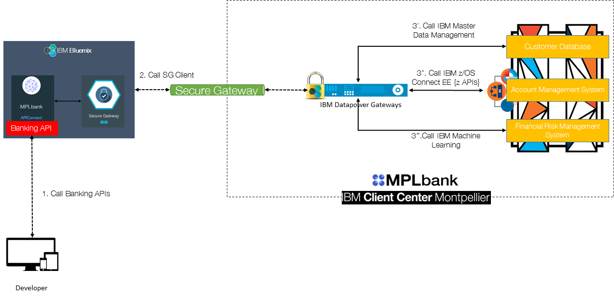
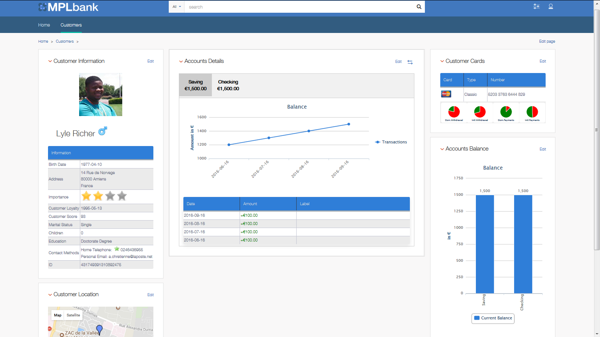

# Banking Digitalization using Hybrid Cloud with z Systems

The following documentation will introduce the available Banking APIs published on [IBM Bluemix] with logical business programs running on the [IBM z Systems Mainframe] through a simulated retail bank called MPLbank for the IBM Developer Journey Program.

Please read this full page the first time to understand objectives, available APIs and the infrastructure used.

# MPLbank

## Architecture

MPLbank is an IBM team, highlighting the IBM Strategy with the IBM z Systems Mainframe and supports many International customers running on Mainframe. The MPLbank Showcase is similar to retail bank and is mainly constituted of an Account Management System, a Payment Hub (not shown in the schema), a Customer Management System & a Financial Risk Management System based on Machine Learning. On top of these components, an API layer hosted in IBM Bluemix has been set up in order to deliver Banking APIs, reachable from many simulated banking channels.

In other words, this API Strategy highlights how an Hybrid Architecture IBM Bluemix/IBM Mainframe is possible with the [IBM Digital Transformation Model]. Following this Model, the MPLbank team applied capabilities/business benefits levels 0 (Run), 1 (Maintain) & 2 (Exppose). The level 3 (Evolve) is the purpose of the IBM Developer Journey Program matching with the speed increase of application development.

Deployed IBM Mainframe Technologies for the Developer Journey :
* [IBM z Systems Mainframe] ([IBM z Systems Mainframe Redbook] & [IBM z Systems Mainframe developerWorks])
* [IBM z/OS] ([IBM z/OS Knowledge Center])
* [IBM CICS Transaction Server] ([IBM CICS TS Knowledge Center] & [IBM CICS TS developerWorks])
* [IBM z/OS Connect Enterprise Edition] ([IBM z/OS Connect EE Knowledge Center] & [IBM z/OS Connect EE developerWorks])
* [IBM Db2] ([IBM Db2 Knowledge Center])
* [IBM Master Data Management] ([IBM Master Data Management Knowledge Center])
* [IBM Machine Learning for z/OS]
* ... and a real core banking system ([SOPRA Account Management]) running in IBM CICS TS!

Deployed IBM Bluemix Technologies for the Developer Journey :
* [IBM Bluemix]
* [IBM API Connect] ([IBM API Connect Knowledge Center] & [IBM API Connect developerWorks])
* [IBM Secure Gateway Service]

An [IBM DataPower Gateway] ([IBM DataPower Gateway Knowledge Center]) has been setup in front of MPLbank for security reasons. It also acts as a Secure Gateway Client and is connected to the Secure Gateway Service in Bluemix.

You will see, by few minutes, the banking APIs definitions for this developer Journey. However, keep in mind that :
* **/customers/** API path calls IBM Master Data Management services in MPLbank.
* **/accounts/** API path calls the Account Management System services in MPLbank.
* **/customers/loan/** API path calls the [Financial Risk Management System] service in MPLbank.

## Banking data

MPlbank team generated more than 500k banking accounts and customers with [IBM SPSS] in order to add credibility for delivered demos as POC or as workload (1000 TPS) to customers. This map represents French banking customers data, stored in MPLbank database. Published Banking APIs will use this set of data and will allow developers to reach banking customers' data (profile, banking contracts) and banking accounts' data (balance, latest transaction).

# How to discover, test & use the Banking APIs in 10 steps?

1.	Sign up to IBM in order to get an [IBM ID].

2.	Go to [IBM Developer Portal] and sign up with your IBM ID.

3.	Create an organization (by giving a name) in order to manage your applications and APIs subscriptions.

4.	**CONGRATULATIONS**. You just succeeded to setup your profil on the IBM Developer Portal! Ready to **subscribe** for Banking APIs?

5.	A banking product (set of banking APIs) is published on the portal. Just follow this step to subscribe to this product: 
    1. Register an application (by clicking on *Apps* from the menu). It will generate a **Client ID** and a **Client Secret** for API Authorization calls.
    2. Subscribe for the APIs (by clicking on *API Product* and selecting Banking API) and link it to the previous registered application

7.	**CONGRATULATIONS**. You just succeeded to subscribe to an API from your developer portal! Ready to **discover** & **test** the banking APIs? 

8.	From the page where you just subscribed the APIs on your application, click on the details of this API on the left panel menu. A new page appears containing all information :
    * The list of operations and definitions in the left panel. 
    * The detail of operations in the middle panel. 
    * Samples of code in the right panel. In this Panel, you can test each API depending on your preferred programming language. Do not forget to fill the couple X-IBM-Client-Id and X-IBM-Client-Secret with the generated Client ID /secret of your registered application.

The API **GET /customers/{customerID}** will give you all necessary information (JSON structure) to use other APIs. Call this API in first. All available customers ID are in the */identifier/customerIDs.txt* file in this Github repository.

9.	**CONGRATULATIONS**. You just succeeded to test APIs ! Ready to **use** APIs ?

10.	According to your technology criteria, you are free to develop an Application using these Banking APIs.
> Use IBM Bluemix to create, test and deploy a quick application. Choose among JAVA Liberty Profile, Node Js servers, Ruby, Python, etc... This platform also provides DevOps tools for a continuous delivery (Git, automatic deployment). [Sign up or log in to IBM Bluemix].

# Example of banking application

A quick banking application has been developed in order to help you to start coding. This web application (HTML/CSS/javascript) uses banking APIs introduced before. 

1.	Import the project *bankingApplication* located in this Github repository into you preferred IDE.
2.	Read the HTML and Javascript code in order to understand how the program works.
3.	In *bankingAPI.js*, please replace *IBM_CLIENT_ID* & *IBM_CLIENT_SECRET* variables by **the generated API client ID & Secret from the [IBM Developer Portal]** 
4.	Open the *index.html* in your favorite web browser.

You will see the application below. A customer identifier has been hardcoded in the variable *customerID* in *bankingAPI.js* file for demos purposes. you can change it though the *identifier* folder in this Github repository. 1000 customers has been generated for the Developer Journey, meaning it represents 1000 different banking customers.

Click on the button **Click here to load a banking customer profile**. This event will call the published API **GET /customer/{customerID}** on the API Developer Portal. A result is displayed in the bottom of the page. Actually, it represents the expected JSON structure returned by the API. Then, explore this banking application through the code and call each services representing each published API.

Finally, take a look in this web application below, developed by the IBM MPLbank for customers demos purposes. It uses exactly the same set of banking APIs. Like described before, we subscribed for an application in the API developer Portal, then subscribed for the banking APIs and finally we spent times to design a user-firendly interface using [IBM Watson Explorer] :). This application is not available for public.

The most important thing is to understand how the API works and which in/out values are expected. All is described in the API documentation in the developer portal.

[IBM Digital Transformation Model]: https://developer.ibm.com/mainframe/ibm-digital-transformation/

[IBM Bluemix]: https://www.ibm.com/us-en/marketplace/cloud-platform
[IBM z Systems Mainframe]: https://www-03.ibm.com/systems/z/

[IBM z Systems Mainframe Redbook]: https://www.redbooks.ibm.com/redbooks.nsf/pages/z13?Open
[IBM z Systems Mainframe developerWorks]: https://developer.ibm.com/mainframe/

[IBM z/OS]: https://www-03.ibm.com/systems/z/os/zos/
[IBM z/OS Knowledge Center]: https://www.ibm.com/support/knowledgecenter/en/SSLTBW

[IBM CICS Transaction Server]: https://www-01.ibm.com/software/data/enterprise-application-servers/cics/
[IBM CICS TS Knowledge Center]: https://www.ibm.com/support/knowledgecenter/en/SSGMGV
[IBM CICS TS developerWorks]: https://developer.ibm.com/cics/

[IBM z/OS Connect Enterprise Edition]: https://www.ibm.com/ms-en/marketplace/connect-enterprise-edition
[IBM z/OS Connect EE Knowledge Center]: https://www.ibm.com/support/knowledgecenter/en/SS4SVW
[IBM z/OS Connect EE developerWorks]: https://developer.ibm.com/mainframe/products/zosconnect/

[IBM Db2]: https://www.ibm.com/analytics/us/en/technology/db2/?lnk=STW_US_SHP_A4_TL&lnk2=learn_DB2
[IBM Db2 Knowledge Center]: https://www.ibm.com/support/knowledgecenter/en/SSEPEK/db2z_prodhome.html

[IBM Master Data Management]: https://www.ibm.com/analytics/us/en/technology/master-data-management/
[IBM Master Data Management Knowledge Center]: https://www.ibm.com/support/knowledgecenter/en/SSWSR9

[IBM Machine Learning for z/OS]: https://www.ibm.com/ms-en/marketplace/machine-learning-for-zos
[IBM Machine Learning for z/OS Knowledge Center]: https://www.ibm.com/support/knowledgecenter/en/SS9PF4

[SOPRA Account Management]: https://www.soprabanking.com/our-offer/solutions/account-management-9

[IBM API Connect]: http://www-03.ibm.com/software/products/en/api-connect
[IBM API Connect Knowledge Center]: https://www.ibm.com/support/knowledgecenter/en/SSMNED 
[IBM API Connect developerWorks]: https://developer.ibm.com/apiconnect/

[IBM Secure Gateway Service]: https://console.bluemix.net/docs/services/SecureGateway/secure_gateway.html

[IBM DataPower Gateway]: http://www-03.ibm.com/software/products/en/datapower-gateway
[IBM DataPower Gateway Knowledge Center]: https://www.ibm.com/support/knowledgecenter/en/SS9H2Y 

[IBM SPSS]: https://www.ibm.com/analytics/us/en/technology/spss/

[IBM ID]: https://www.ibm.com/account/us-en/signup/register.html
[IBM Developer Portal]: https://developer-contest-spbodieusibmcom-prod.developer.us.apiconnect.ibmcloud.com/

[Sign up or log in to IBM Bluemix]: https://console.bluemix.net/registration/?

[Financial Risk Management System]:https://github.com/IBM/Financial-risk-management-using-machine-learning-on-zSystems

[IBM Watson Explorer]: https://www.ibm.com/us-en/marketplace/content-analytics